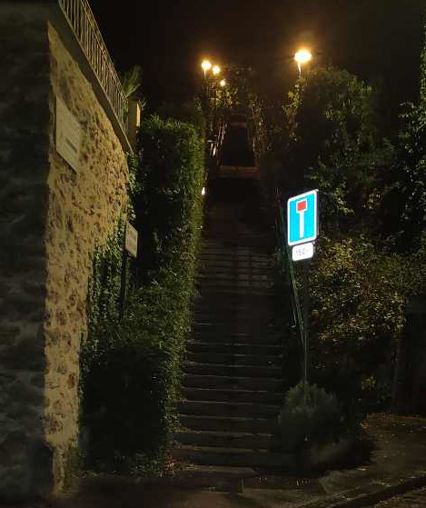

# Stairs of Saclay

➪ [**The paper**](https://raw.githubusercontent.com/rambip/stairs-of-saclay/main/Stairs_of_Saclay.pdf) 

This project is a research paper that was written in Saclay, France, to answer the follwing question:

> what is the worse stairway between Lozere and Le Guichet ?

---

If you don't know what it is about, it is an endless debate between students on the best way to go from the [School Campus](https://www.ecosia.org/search?q=plateau%20de%20saclay&addon=firefox&addonversion=4.1.0&method=topbar) to the nearest city-train station.

Have a good read (link at the top of this file)

## Data

The data folder contains the gps data that was used to carry out the experiments

There is a python program `read_gps.py` if you want to know how the graphics were maid.

# Acknowledgements

I greatly thanks meloncarluxdexcidouilledesaint, my mentor for this PhD.

